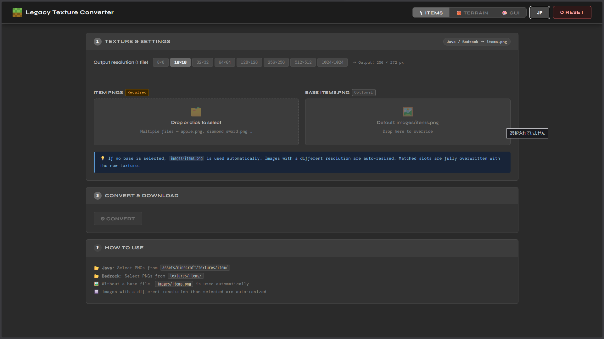

# Legacy Texture Converter

**Java / Bedrock エディションのテクスチャパックを Minecraft Legacy Console Edition (LCE) 向けに変換・編集するブラウザツールです。**  
A browser-based tool to convert Java/Bedrock texture packs for Minecraft Legacy Console Edition (LCE).



---

## 機能 / Features

### 🗡 Items
Java / Bedrock の個別アイテムテクスチャ PNG を `items.png` アトラス形式に変換します。  
Converts individual item texture PNGs (Java/Bedrock) into the `items.png` atlas format.

- 複数ファイルの一括変換 / Batch conversion of multiple files
- 出力解像度を 8×8 〜 1024×1024 から選択 / Output tile size from 8×8 to 1024×1024
- カスタムベース `items.png` の指定に対応 / Supports custom base `items.png`
- 解像度が異なる画像は自動リサイズ / Auto-resizes images with mismatched resolution

### 🧱 Terrain
ブロックテクスチャ PNG を `terrain.png`・`terrainMipMapLevel2.png`・`terrainMipMapLevel3.png` の 3 ファイルに変換します。  
Converts block texture PNGs into `terrain.png`, `terrainMipMapLevel2.png`, and `terrainMipMapLevel3.png`.

- 16×16 / 32×32 タイル解像度に対応 / Supports 16×16 and 32×32 tile resolutions
- MipMap ファイルを自動生成 / Automatically generates MipMap files
- カスタムベース `terrain.png` の指定に対応 / Supports custom base `terrain.png`

### 🎨 GUI (ARC / FUI Editor)
Minecraft Legacy Console Edition の `.arc` ファイルを読み込み、内部の `.fui` ファイルを編集できます。  
Load `.arc` files from Minecraft Legacy Console Edition and edit `.fui` files inside.

- ARC アーカイブの展開・再パック / Extract and repack ARC archives
- FUI ファイル内の画像を閲覧・書き出し / Browse and export images inside FUI files
- 画像の差し替えに対応 / Replace images with custom PNG/JPEG
- テキストファイル (.txt) のインラインエディタ / Inline editor for text files (.txt)
- 色補正 R↔B スワップ機能 / R↔B color swap for color correction

---

## 使い方 / How to Use

インストール不要。ブラウザで開くだけで動作します。  
No installation required — just open in a browser.

```
index.html をブラウザで開く / Open index.html in your browser
```

または GitHub Pages 等でホストしてオンラインで使用することもできます。  
You can also host it on GitHub Pages or any static file server.

### ファイル構成 / File Structure

```
/
├── index.html
├── style.css
├── app.js
└── images/
    ├── items.png          # デフォルトベース / Default base atlas
    ├── terrain_16x.png    # デフォルトベース (16×16) / Default base (16×16)
    ├── terrain_32x.png    # デフォルトベース (32×32) / Default base (32×32)
    └── thumbnail.png      # OGP サムネイル / OGP thumbnail
```

---

## 対応ブラウザ / Browser Support

モダンブラウザであれば動作します（Chrome / Firefox / Edge / Safari）。  
Works in all modern browsers (Chrome / Firefox / Edge / Safari).

- Canvas API を使用 / Uses Canvas API
- File API を使用 / Uses File API
- サーバー不要・完全クライアントサイド動作 / No server required — fully client-side

---

## 言語切替 / Language Toggle

ヘッダー右上の `EN` / `JP` ボタンで日本語・英語を切り替えられます。  
Use the `EN` / `JP` button in the top-right header to switch between Japanese and English.

---

## 参考リポジトリ / References

このツールは以下のリポジトリを参考に制作しました。  
This tool was developed with reference to the following repositories.

| Repository | Description |
|---|---|
| [kzpns/FuiEditor](https://github.com/kzpns/FuiEditor) | FUI ファイルのパース・書き出しロジックの参考 / FUI file parsing and export logic |
| [PhoenixARC/MUArchiveEditor](https://github.com/PhoenixARC/MUArchiveEditor) | ARC アーカイブフォーマットの解析の参考 / ARC archive format analysis |
| [jeremy2206/Java-to-LCE-Texture-Pack-Converter](https://github.com/jeremy2206/Java-to-LCE-Texture-Pack-Converter) | Java → LCE テクスチャ変換のタイルマッピングの参考 / Tile mapping for Java to LCE texture conversion |

---

## ライセンス / License

MIT License
